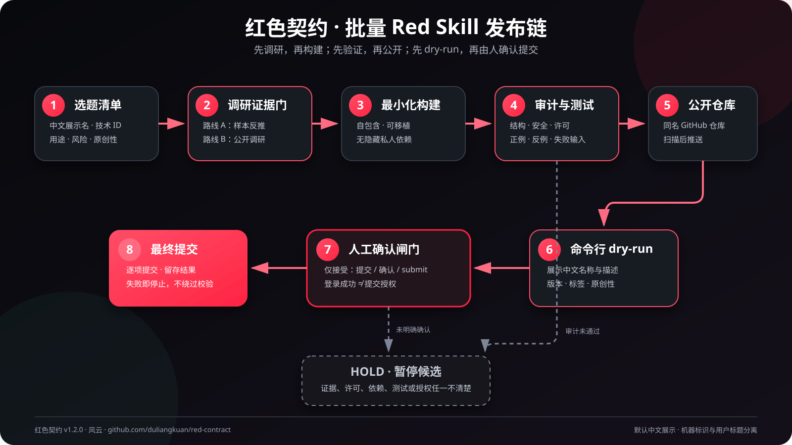
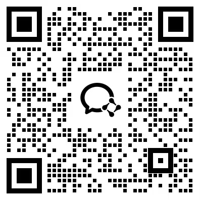
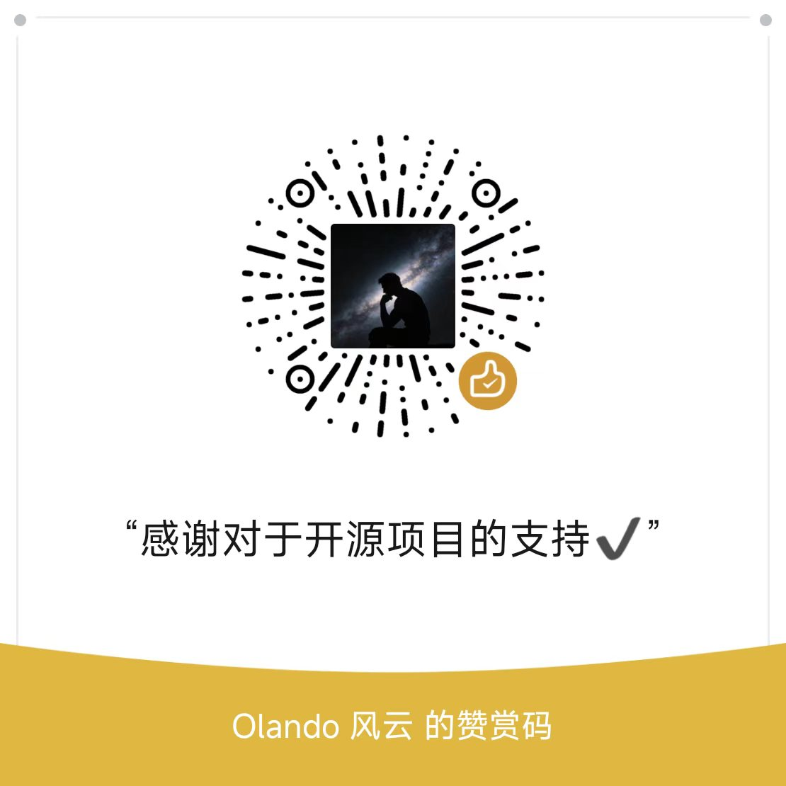

<h1 align="center">🔴 红色契约</h1>

<p align="center">
  <b>面向小红书 Red Skill 的保守批量构建与发布前审计协议</b><br>
  <sub>先调研，再构建；先验证，再公开；先 dry-run，再由人确认提交</sub>
</p>

<p align="center">
  <a href="LICENSE"></a>
  
  
  <a href="https://github.com/duliangkuan/red-contract/commits/main"></a>
  <a href="https://github.com/duliangkuan/red-contract/stargazers"></a>
</p>

<p align="center">
  <a href="#这是什么">这是什么</a> ·
  <a href="#架构">架构</a> ·
  <a href="#核心规则">核心规则</a> ·
  <a href="#快速开始">快速开始</a> ·
  <a href="#目录结构">目录结构</a> ·
  <a href="#-关于作者">关于作者</a>
</p>

---

## 这是什么

红色契约是一套可复用的 Red Skill 开发协议，用来把一个或一批选题稳妥地推进为：

- 独立、自包含、可移植的 Skill；
- 通过结构、安全、许可和代表性测试的公开版本；
- 与技术 Skill ID 同名的公开 GitHub 仓库；
- 可供用户逐项确认的 Red Skill 命令行 dry-run 载荷。

它解决的不是“怎么绕过审核”，而是批量开发时最容易失控的五件事：**选题同质化、依据不足、隐藏依赖、公开泄密和越权提交**。

> 红色契约默认推进到 dry-run。只有用户看过载荷后明确回复“提交”“确认”或 `submit`，才能执行最终提交。

## 适合谁

- 一天需要连续构建多个原创 Red Skill 的创作者；
- 希望每个 Skill 都有独立公开仓库和清楚版本血缘的开发者；
- 需要把私人工作流整理为公开、最小、可验证产品的人；
- 想让不同 Agent 在新对话中遵守同一套发布边界的团队。

它不读取浏览器登录态，不包装无权公开的语料，不复制同质 Skill，也不会自动跳过用户的最终确认。

---

## 架构

[](https://raw.githubusercontent.com/duliangkuan/red-contract/main/docs/architecture.svg)

> [点击打开 SVG 原图](https://raw.githubusercontent.com/duliangkuan/red-contract/main/docs/architecture.svg)，可在浏览器中无限放大。

整个流程只有一条成功路径，任何关键门禁不通过都会进入 `hold`，不会为了凑数量继续上传：

1. 建立批量选题清单；
2. 通过调研与证据门；
3. 按最小形态构建独立 Skill；
4. 完成结构、安全、许可、可移植性和代表性测试；
5. 创建同名公开 GitHub 仓库并推送；
6. 生成 Red Skill CLI dry-run 载荷；
7. 等待用户明确确认后再最终提交。

---

## 核心规则

### 1. 先调研，后设计

核心规则、分类、阈值和依赖选型都要有依据。调研支持两条路线：

| 路线 | 适用情况 | 基本要求 |
|---|---|---|
| A：样本反推 | 有合法真实案例或用户自有数据 | 同时看成功样本、对照样本和反例 |
| B：公开调研 | 没有足够真实语料的冷启动主题 | 优先官方规范、原始论文、源码和维护者说明 |

证据分为 E1 可复现实验或用户数据、E2 官方与一手技术资料、E3 多案例交叉证据、H 待验证假设。搜索摘要和模型输出不能直接当证据。

### 2. 中文展示，技术 ID 独立

- 用户可见的名称、简介、用途、输入输出和错误提示默认使用中文；
- 目录名、Skill ID 和 frontmatter `name` 使用稳定的 kebab-case 技术标识；
- 英文仅保留给代码、命令、API、包名、协议名和必要专有名词。

例如：发布名称使用“人类图人格测试与完整解读”，技术 ID 使用 `human-design-personality-test`。

### 3. 每个 Skill 一个公开仓库

仓库与技术 Skill ID 同名。推送前必须再次扫描凭据、私人语料、绝对路径、运行状态、缓存和第三方受限资料。公开 GitHub 推送属于默认动作，但不等于允许最终提交 Red Skill。

### 4. 用户保留最后一击

以下行为都不等于最终提交授权：

- 扫码登录成功；
- 允许安装依赖；
- GitHub 推送完成；
- 回复“好了”“可以了”；
- 完成 dry-run。

只有在展示 dry-run 载荷之后收到明确的“提交”“确认”或 `submit`，才可以提交。

### 5. 不使用浏览器自动化上传

Red Skill 的登录、审核和上传不使用浏览器自动化，不读取 Cookie，不绕过 TLS、权限或平台校验。

---

## 快速开始

### 1. 安装

先克隆仓库，再把整个目录放入当前 Agent 文档指定的用户 Skill 目录：

```bash
git clone https://github.com/duliangkuan/red-contract.git red-contract
```

如果宿主使用其他 Skill 目录，将仓库放入对应目录即可。重新加载会话后，直接说：

```text
红色契约：今天批量做 10 个原创 Red Skill。
```

### 2. 审计一个候选 Skill

需要 Node.js 18 或更高版本：

```bash
cd red-contract
node scripts/audit-skill.mjs <目标-Skill-目录>
```

审计结果有三种状态：

| 状态 | 含义 | 下一步 |
|---|---|---|
| `pass` | 没有发现高、中风险项 | 继续运行目标 Skill 测试 |
| `review` | 存在需要人工解释的中风险项 | 说明或修复后再推进 |
| `block` | 存在高风险项 | 必须修复，不进入 dry-run |

### 3. 运行审计器测试

```bash
node scripts/audit-skill.test.mjs
```

---

## 默认交付物

每个候选 Skill 最终应得到：

1. 中文展示名与稳定技术 Skill ID；
2. 独立 Skill 目录；
3. 调研证据记录与差异化说明；
4. 结构、安全、许可、可移植性和代表性测试结果；
5. 同名公开 GitHub 仓库；
6. Red Skill CLI dry-run 载荷；
7. 最终提交前的人工确认记录。

---

## 目录结构

```text
red-contract/
├── SKILL.md                         # 红色契约主协议
├── README.md                        # GitHub 项目说明
├── LICENSE                          # MIT 许可证
├── references/
│   ├── research-protocol.md         # 调研、证据与版本血缘
│   └── release-checklist.md         # 保守发布检查表
├── scripts/
│   ├── audit-skill.mjs              # 静态审计器
│   └── audit-skill.test.mjs         # 审计器测试
├── docs/
│   └── architecture.svg             # 架构图
└── assets/                          # 公众号、微信、交流群与赞赏码
```

`SKILL.md` 是运行入口，详细规范按需加载；README、架构图和二维码服务于 GitHub 展示，不替代运行协议。

---

## 安全边界

- 不打包 Cookie、token、密码、私钥或私人数据库；
- 不写死个人绝对路径、主机名和内部项目状态；
- 不公开 `_research/`、`corpus/`、抓取缓存、竞品副本和历史输出；
- 不把医疗、法律、金融、心理或玄学内容包装成确定性诊断；
- 不把第三方开源依赖伪装成完全原创，必须保留许可证与来源；
- 不以批量为理由降低每个 Skill 的测试和提交标准。

完整门禁见 [`references/release-checklist.md`](references/release-checklist.md)，调研协议见 [`references/research-protocol.md`](references/research-protocol.md)。

---

## 🤝 关于作者

**风云**，公众号「研究 Agent 的云」主理人，长期研究 Agent、Skill、内容自动化和一人公司工作流。

红色契约来自真实批量开发与发布过程中的失败复盘：不是一份空泛的提示词模板，而是一套把原创、证据、工程验证、公开仓库和提交授权连在一起的工作协议。

| 渠道 | 怎么找到我 |
|---|---|
| 📰 **公众号** | 研究 Agent 的云（微信搜索关注） |
| 💬 **微信号** | `FengYunAgent`（加好友请备注“来自 GitHub”） |
| 📧 **邮箱** | 2330304961@qq.com |
| 🐙 **GitHub** | [@duliangkuan](https://github.com/duliangkuan) |

---

## 📱 公众号 · 个人微信 · 交流群 · 支持作者

> 如果这套协议对你有帮助，欢迎关注公众号、加微信交流、进入交流群，或者给仓库一个 Star。

<table align="center">
  <tr>
    <th align="center">关注公众号</th>
    <th align="center">加个人微信</th>
    <th align="center">加入交流群</th>
    <th align="center">请我喝咖啡 ☕</th>
  </tr>
  <tr>
    <td></td>
    <td></td>
    <td></td>
    <td></td>
  </tr>
  <tr>
    <td align="center"><sub>研究 Agent 的云</sub></td>
    <td align="center"><sub>FengYunAgent · 备注 GitHub</sub></td>
    <td align="center"><sub>群活码 · 不定期更新</sub></td>
    <td align="center"><sub>支持持续开源</sub></td>
  </tr>
</table>

---

## 📜 许可证

[MIT](LICENSE) · Copyright (c) 2026 风云 (GitHub: duliangkuan)
